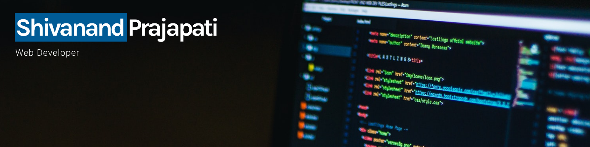

<h1 align="center">Hi 👋, I'm Shivanand Prajapati</h1>
<h3 align="center">A Passionate Front-End Web Developer And Aspiring Full-Stack Developer</h3>
<!-- 
 -->

  

- 🌱 I’m currently learning **Next.js and Backend**

- 📝 I write articles on [https://shivanand.hashnode.dev/](https://shivanand.hashnode.dev/)

- 💬 Ask me about **HTML, CSS, Tailwind CSS, JavaScript, TypeScript, React, Redux, Redux Toolkit, Tanstack Table, Tanstack Query, MongoDB, Express, Nodejs**

- 📫 How to reach me **shivanand0297@gmail.com**

<h3 align="left">Connect with me:</h3>

<h3 align="left">Languages and Tools:</h3>

<!--  html  --><!-- css --><!-- tailwind --><!-- bootstrap --><!-- git --><!-- javascript --><!-- Typescript --><!-- reactjs --><!-- Nextjs --><!--  nodejs --><!--  mongodb --><!--  mongoose -->
  
<!-- mongoose -->
  
  
  

&nbsp;

